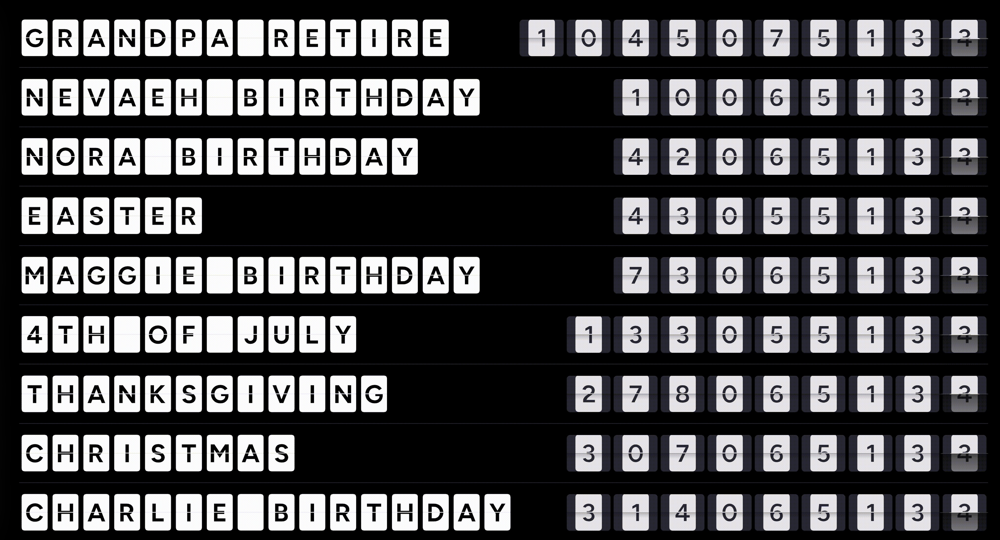

# FlipClock

A full-screen split-flap countdown display designed for a 1920×1080 TV or monitor. Shows countdowns to custom events alongside auto-generated US holidays, styled with the SplitFlapTV font and animated with [PQINA Tick](https://pqina.nl/).



## Features

- Split-flap flip animation (days · hours · minutes · seconds)
- Loads personal events from `FlipClockEvents.json`
- Auto-generates major US holidays (New Year's Day, Easter, 4th of July, Thanksgiving, Christmas)
- Repeating events (e.g. birthdays) automatically advance to the next occurrence
- Pinned events appear at the top of the list
- Displays up to 9 events, sorted by nearest date
- Auto-refreshes the page every hour

## Running with Docker

```bash
docker compose up -d
```

Open [http://localhost:8080/FlipClock.html](http://localhost:8080/FlipClock.html).

The default admin password is `test123`. Change it by setting `FLIPCLOCK_PASSWORD` in `docker-compose.yml` before starting the container.

## Running without Docker

Serve the directory with any PHP-capable web server (Apache, Nginx + PHP-FPM, etc.) and create `~/.env` in the web server user's home directory:

```bash
# Generate a bcrypt hash of your chosen password
php -r "echo password_hash('yourpassword', PASSWORD_BCRYPT) . PHP_EOL;"
```

Then write the hash to `~/.env` (see `.env.example` for the expected format).

## Events file — `FlipClockEvents.json`

```json
[
    {
        "label": "Event Name",
        "targetDate": "2027-01-01T00:00:00-05:00",
        "pinned": false,
        "repeats": true
    }
]
```

| Field | Type | Description |
|---|---|---|
| `label` | string | Display name |
| `targetDate` | ISO 8601 string | Target date/time with timezone offset |
| `pinned` | boolean | `true` pins the event to the top |
| `repeats` | boolean | `true` auto-advances the year when the date has passed |

## Updating events via POST

`FlipClock.php` accepts a password-protected `POST` request to overwrite `FlipClockEvents.json`:

```
POST /FlipClock.php
Content-Type: application/x-www-form-urlencoded

password=yourpassword&events[0][label]=...&events[0][targetDate]=...&events[0][pinned]=1
```

On success it redirects back to `FlipClock.html`.

## Wall-mounted Raspberry Pi display

FlipClock works great as a always-on wall display using a Raspberry Pi and a portable USB-C monitor.

### Hardware

- **Raspberry Pi 4 or 5** — plenty of power for a full 1080p browser in kiosk mode
- **Portable 1080p monitor** — any USB-C display with a VESA mount (e.g. Lepow, Arzopa, GeChic). Powers directly from the Pi's USB-C port on many models, keeping cable clutter to a minimum
- **VESA wall mount** — a low-profile tilting mount lets you hang the monitor flat against the wall
- **Short USB-C cable** — route behind the monitor to the Pi, which can be mounted directly to the back of the monitor using the VESA holes and a Pi case with a VESA adapter plate

### Software setup on the Pi

1. **Install Raspberry Pi OS Lite** (64-bit) and enable SSH.

2. **Install a minimal browser stack:**
   ```bash
   sudo apt update && sudo apt install -y chromium-browser xorg openbox unclutter
   ```

3. **Install PHP + Apache** (or use Docker — see above):
   ```bash
   sudo apt install -y apache2 php libapache2-mod-php
   sudo cp -r /path/to/FlipClock /var/www/html/flipclock
   ```
   Set up `~/.env` for the `www-data` user as described in the [Running without Docker](#running-without-docker) section.

4. **Auto-start Chromium in kiosk mode.** Create `/etc/xdg/openbox/autostart`:
   ```bash
   # Disable screen blanking
   xset s off
   xset -dpms
   xset s noblank

   # Hide the cursor after 1 second of inactivity
   unclutter -idle 1 &

   # Launch Chromium in kiosk mode
   chromium-browser --kiosk --noerrdialogs --disable-infobars \
     --disable-session-crashed-bubble \
     http://localhost/flipclock/FlipClock.html &
   ```

5. **Auto-start X on login.** Add to `~/.bash_profile`:
   ```bash
   [[ -z $DISPLAY && $XDG_VTNR -eq 1 ]] && startx
   ```

6. **Enable auto-login** for your user via `raspi-config` → System Options → Boot / Auto Login → Console Autologin.

Reboot and the display comes up automatically, refreshes itself every hour, and survives power cuts cleanly.

### Tips

- Set the monitor's physical rotation in `/boot/firmware/config.txt` with `display_rotate=1` (90°) or `display_rotate=3` (270°) if you hang it in portrait orientation.
- Use a smart plug on a timer or home-automation schedule to cut power at night and restore it in the morning — the Pi boots straight back into the display.
- If the Pi is mounted behind the monitor, a right-angle USB-C adapter keeps the cable tidy.

## File overview

| File | Purpose |
|---|---|
| `FlipClock.html` | Main display page |
| `FlipClock.php` | Password-protected endpoint to save events |
| `FlipClock_ajax.php` | Returns last-modified timestamp of `FlipClock.html` |
| `FlipClockEvents.json` | Persisted event list |
| `flip.min.css` / `flip.min.js` | PQINA Tick library |
| `fonts/` | SplitFlapTV font files |
| `Dockerfile` / `docker-compose.yml` | Docker setup |
| `.env.example` | Template for the `~/.env` password file |
